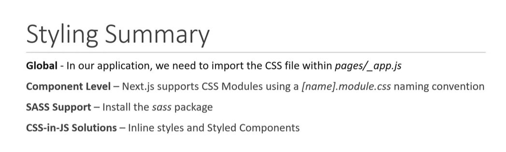
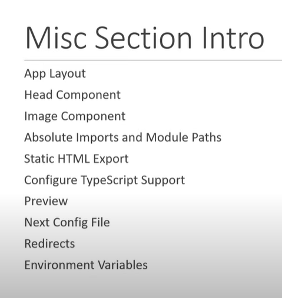
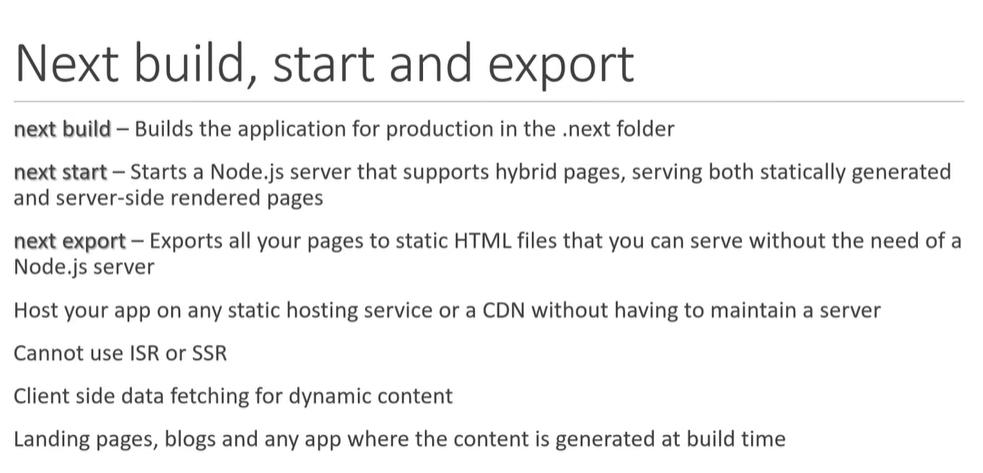
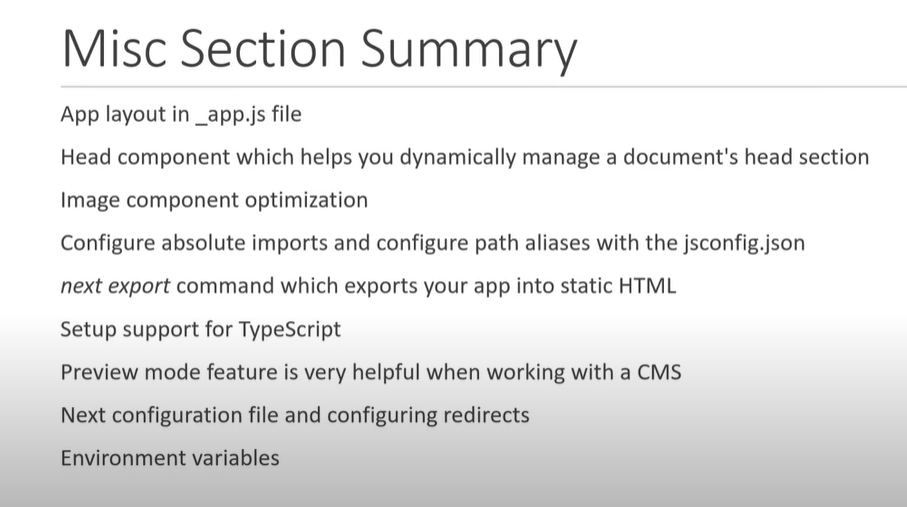

# CSS



1. global.css ==>
   external file for css which we have to import in root file(\_app.js) in which we can write any css it will accessible anywhere in all pages

2. pageName.module.css ==>
   About.module.css
   Used for writing css for specific component and we also have to import in that component

   ```javascript
       import styles from "../styles/about.module.css
       <nav className = {styles.header}></nav>

       if there is multiple classes then there is a approach to use them

       <nav className = {`${styles.header} ${styles.background}`}></nav>
   ```

3. For inline Css ==>

   ```javascript
   <h1 style={{ color: "red" }}>Heading</h1>
   ```

# Components



## Head Component

```javascript
import Head from 'next/head'

function IndexPage() {
  return (
    <div>
        <Head>
            <title>HomePage</title>
            <meta charset="UTF-8">
            <meta name="description" content="Free Web tutorials">
            <meta name="keywords" content="HTML, CSS, JavaScript, Next.js">
            <meta name="author" content="Akansha Verma">
            <meta name="viewport" content="width=device-width, initial-scale=1.0">
        </Head>
        <p>Hello world!</p>
    </div>
)}

export default IndexPage
```

- You can also add title for each page by simple importing head component in your page.

## Image Component

- Provide optimation of image by reducing the size of high resolution image
- Provide lazy loading as with lazy loading we won't download images that are not required at that time
- Ability to render a "placeholder" image while the actual image is still loading

## Static HTML Export

It has so many limitations like we can't use <Image/> Component, SSR and fallback always be false.



## Redirects

- Redirects allow you to redirect an incoming request path to a different destination path.

- To use redirects you can use the redirects key in next.config.js:

```javascript
redirects: async () => {
  return [
    {
      source: "/profile",
      destination: "/about",
      permanent: false,
    },
  ];
};
```

`redirects` is an async function that expects an array to be returned holding objects with `source`, `destination`, and `permanent` properties:

- `source` is the incoming request path pattern.
- `destination` is the path you want to route to.
- `permanent` true or false - if true will use the 308 status code which instructs clients/search engines to cache the redirect forever, if false will use the 307 status code which is temporary and is not cached.

## Environment Variables

### Runtime Environment Variables

Next.js can support both build time and runtime environment variables.

By default, environment variables are only available on the server. To expose an environment variable to the browser, it must be prefixed with `NEXT_PUBLIC_`. However, these public environment variables will be inlined into the JavaScript bundle during next build.

```javascript
DB_HOST = localhost;
DB_USER = myuser;
DB_PASS = mypassword;
NEXT_PUBLIC_PASSWORD = hello;
```

### Default Environment Variables

- In general only one .env.local file is needed. However, sometimes you might want to add some defaults for the development (next dev) or production (next start) environment.

- Next.js allows you to set defaults in `.env`(all environments), `.env.development` (development environment), and `.env.production` (production environment).

- `.env.local` always overrides the defaults set.

`Good to know:` .env, .env.development, and .env.production files should be included in your repository as they define defaults. .env\*.local should be added to .gitignore, as those files are intended to be ignored. .env.local is where secrets can be stored.

### Test Environment Variables

Apart from development and production environments, there is a 3rd option available: test. In the same way you can set defaults for development or production environments, you can do the same with a `.env.test` file for the testing environment (though this one is not as common as the previous two). Next.js will not load environment variables from `.env.development` or `.env.production` in the testing environment.

This one is useful when running tests with tools like `jest` or `cypress` where you need to set specific environment vars only for testing purposes. Test default values will be loaded if `NODE_ENV` is set to `test`, though you usually don't need to do this manually as testing tools will address it for you.



# Next-Auth

NextAuth.js is a complete open-source authentication solution for Next.js applications.
It is designed from the ground up to support Next.js and Serverless.

## Flexible and easy to use

- Designed to work with any OAuth service, it supports OAuth 1.0, 1.0A, 2.0 and OpenID Connect
- Built-in support for many popular sign-in services
- Supports email / passwordless authentication
- Supports stateless authentication with any backend (Active Directory, LDAP, etc)
- Supports both JSON Web Tokens and database sessions
- Designed for Serverless but runs anywhere (AWS Lambda, Docker, Heroku, etc…)

## Own your own data

- NextAuth.js can be used with or without a database.

- An open-source solution that allows you to keep control of your data
- Supports Bring Your Own Database (BYOD) and can be used with any database
- Built-in support for `MySQL`, `MariaDB`, `Postgres`, `SQL Server`, `MongoDB` and `SQLite`
- Works great with databases from popular hosting providers
- Can also be used without a database (e.g. OAuth + JWT)

`Note: Email sign-in requires a database to be configured to store single-use verification tokens.`

## To install Next-Auth

`npm i next-auth`

## Add API Route

To add NextAuth.js to a project create a file called `[...nextauth].js` in `pages/api/auth`.

```javascript
import NextAuth from "next-auth";
import GithubProvider from "next-auth/providers/github";

export const authOptions = {
  // Configure one or more authentication providers
  providers: [
    GithubProvider({
      clientId: process.env.GITHUB_ID,
      clientSecret: process.env.GITHUB_SECRET,
    }),
    // ...add more providers here
  ],
};
export default NextAuth(authOptions);
```

## Configure Shared session state

To be able to use useSession first you'll need to expose the session context, <SessionProvider />, at the top level of your application i.e., `pages/_app.jsx` :

```javascript
import { SessionProvider } from "next-auth/react";

export default function App({
  Component,
  pageProps: { session, ...pageProps },
}) {
  return (
    <SessionProvider session={session}>
      <Component {...pageProps} />
    </SessionProvider>
  );
}
```

## Frontend - Add React Hook

The `useSession()` React Hook in the NextAuth.js client is the easiest way to check if someone is signed in.

```javascript
//components/login-btn.jsx
import { useSession, signIn, signOut } from "next-auth/react";

export default function Login_Btn() {
  const { data: session } = useSession();
  if (session) {
    return (
      <>
        Signed in as {session.user.email} <br />
        <button onClick={() => signOut()}>Sign out</button>
      </>
    );
  }
  return (
    <>
      Not signed in <br />
      <button onClick={() => signIn()}>Sign in</button>
    </>
  );
}
```

## Backend - API Route

To protect an API Route, you can use the `getServerSession()` method.

```javascript
//pages/api/restricted.js
import { getServerSession } from "next-auth/next";
import { authOptions } from "./auth/[...nextauth]";

export default async (req, res) => {
  const session = await getServerSession(req, res, authOptions);

  if (session) {
    res.send({
      content:
        "This is protected content. You can access this content because you are signed in.",
    });
  } else {
    res.send({
      error:
        "You must be signed in to view the protected content on this page.",
    });
  }
};
```

## CLIENT API

### useSession()
- It is CLIENT-side hook.
- The `useSession()` React Hook in the NextAuth.js client is the easiest way to check if someone is signed in.
- useSession() returns an object containing two values: 
  1. data  
  2. status:

- `data`: This can be three values: Session / undefined / null.
 1. when the session hasn't been fetched yet, data will be `undefined`
 2. in case it failed to retrieve the session, data will be `null`
 3. in case of success, data will be `Session`.
  - `session`: 
    ```javascript
    {
      user: {
        name: string
        email: string
        image: string
      },
      expires: Date // This is the expiry of the session, not any of the tokens within the session``
    }
    ```
- `status`: enum mapping to three possible session states: "loading" | "authenticated" | "unauthenticated"


```javascript
import { useSession } from "next-auth/react"

export default function Component() {
  const { data: session, status } = useSession()

  if (status === "authenticated") {
    return <p>Signed in as {session.user.email}</p>
  }

  return <a href="/api/auth/signin">Sign in</a>
}
```