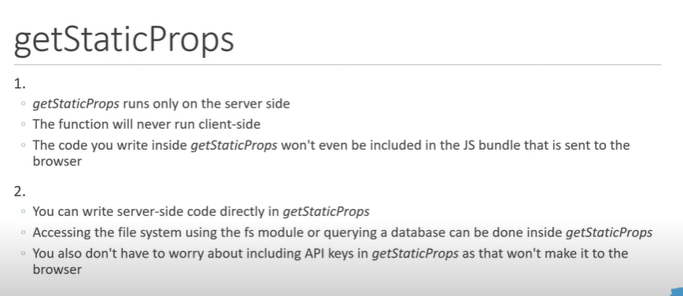
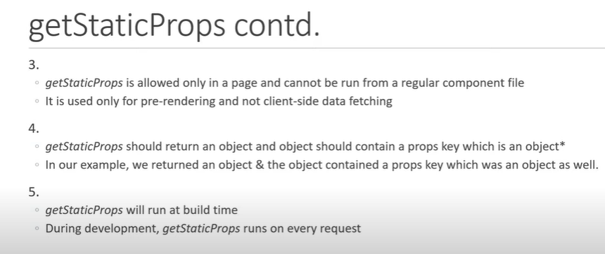
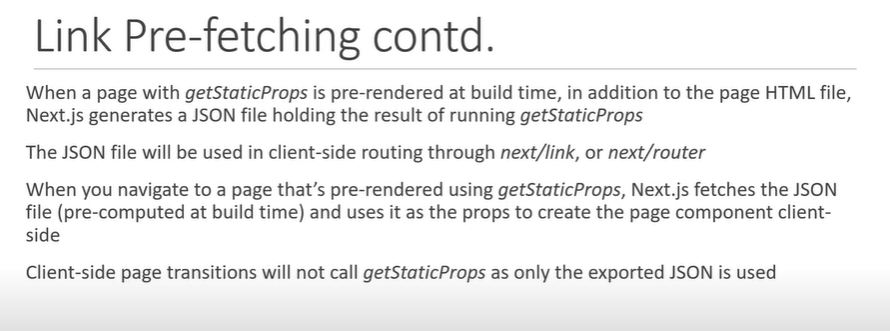
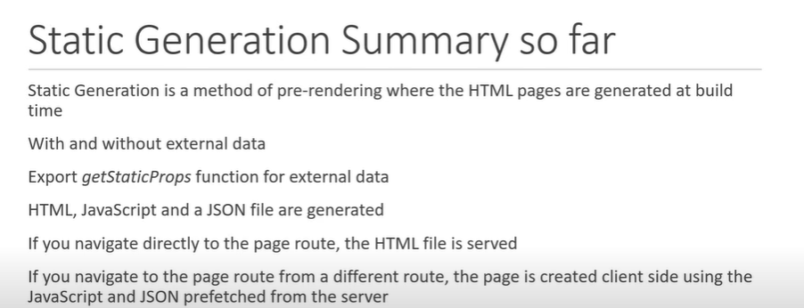
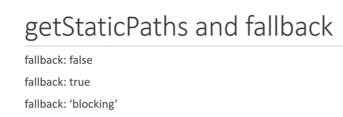
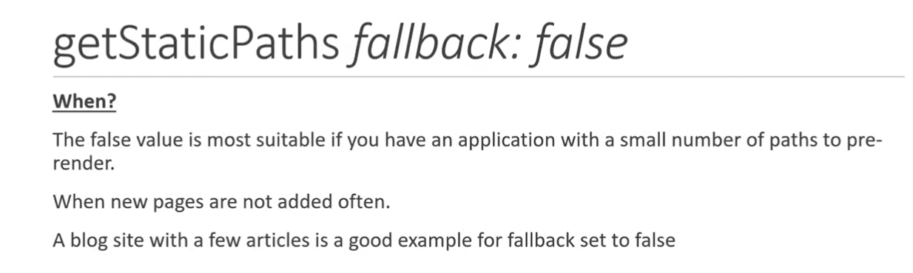
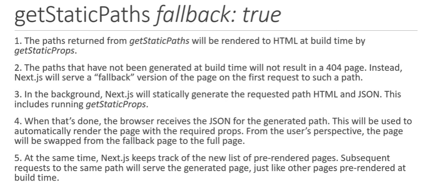

# NEXT.JS BASICS

It is not possible to build a full feature rich app for production using REACT bcz it is used for building UI. You also have to make decisions on other features of apps like authentication, routing, styling.
But Next.js is a React framework for building full-stack web applications. It uses a package that React use for building UI. It is loaded with so many features that simplifies the process of building a react app fo production. There is no need to install additional packages. Next.js provides everything.

## FEATURES OF NEXT.JS

- File based routing
- Pre-rendering (Pre-rendered websites can have much better SEO scores. This is because pre-rendered websites generate the final HTML output for a page at build time.)
- API routes
- Supporting for CSS module
- Authentication
- Dev and Prod build System

## Routing in Next.js

- Route with Pages (localhost:3000/blog)
- Nested routes (localhost:3000/blog/blog1)
- Dynamic routes (localhost:3000/product/id) [params].js and useRouter()
- Nested Dynamic Routes (localhost:3000/product/id/review/id) [params].js and useRouter()
- Catch-all routes (localhost:3000/docs/feature1/concept1)[...params].js and useRouter()
- Navigate from the UI using Link component
- Programmatically navigating b/w pagaes using useRouter()
- Custom 404 page with all necessary styling (404.js)

### Link

In Next.js, the `Link` component is used for client-side navigation between pages in your application. The `replace` attribute in the Link component allows you to replace the current URL in the history stack instead of adding a new entry to the history stack when the link is clicked.

Props of Link : href, replace, scroll, prefetch, passHref

The `replace` attribute is useful in situations where you want to perform navigation but don't want the user to be able to navigate back to the previous page using the browser's back button. This can be helpful for certain workflows or scenarios where you don't want the user to revisit a particular page after navigating away from it.

Some common cases where you might use the replace attribute:

- Redirects after Form Submission: After a form submission, you might want to redirect the user to a new page. Using replace ensures that if the user hits the back button, they won't navigate back to the form submission page, which could potentially cause issues with resubmission.

- Authentication Flows: In authentication flows, you might redirect users after successful login or logout. Using replace can help maintain cleaner navigation behavior, preventing users from accidentally navigating back to sensitive pages after logging out.

### Difference b/w using Link component and useRouter() Hook:

In Next.js, both Link and useRouter() are used for navigation, but they serve slightly different purposes and have different use cases.

`Link`

- The Link component is a built-in component provided by Next.js for `declarative` client-side navigation. It is used to navigate between pages in your Next.js application.
- It pre-fetches the linked page in the background, which helps in faster navigation and improves the user experience.

```javascript
import Link from "next/link";

const MyComponent = () => (
  <Link href="/about">
    <a>About</a>
  </Link>
);
```

`useRouter()`

- The useRouter() hook is provided by Next.js's next/router module. It gives you access to the router object, allowing you to programmatically navigate between pages, access route parameters, query parameters, etc.
- Unlike Link, which is a declarative way of navigating, useRouter() is a `imperatively` way of navigating used when navigate based on some logic, such as form submissions, button clicks, or user authentication.

```javascript
import { useRouter } from "next/router";

const MyComponent = () => {
  const router = useRouter();

  const handleClick = () => {
    router.push("/about");
  };

  return <button onClick={handleClick}>Go to About</button>;
};
```

### Difference b/w using Declarative and Imperative Programming:

`Declarative Programming:`

- Declarative programming focuses on describing what you want to achieve without specifying how to achieve it.
- Examples of declarative programming include `HTML`, `CSS`, `SQL`, and declarative UI frameworks like `React`.

`Imperative Programming:`

- Imperative programming focuses on describing how to achieve a desired outcome step by step.
- Examples of imperative programming include traditional `JavaScript` programming, control structures like loops and conditionals, and direct DOM manipulation.

`Declarative Navigation with Link:`

- When you use the Link component in Next.js, you declare the target destination (where you want to navigate) by specifying the href attribute.
- The framework (Next.js) takes care of the implementation details, such as handling client-side navigation, prefetching linked pages, and updating the URL in the browser.
- You focus on declaring the intent (the desired navigation) without worrying about how the navigation is implemented under the hood.

`Imperative Navigation with useRouter():`

- When you use the useRouter() hook in Next.js, you explicitly specify how to navigate by calling methods like `push()` or `replace()` on the router object.
- You define the navigation logic imperatively based on conditions, user actions, or events.
- You have more control over the navigation process, but you're responsible for managing the navigation flow and handling any side effects manually.

## Pre-Rendering & Data Fetching

Types of pre-rendering:

1. Static Generation

- without data
- with data
- Incremental Static Generation
- Dynamic parameters when fetching data

2. Serve-side Rendering

- data fetching

Client-side data fetching

Combining pre-rendering with client-side data fetching

### Pre-rendering

`What ?`

Pre-rendering refers to the process of generating HTML with the necessary data for a page in our application.

`Why ?`

Pre-rendering can result in better performance and SEO.


### Static Generation


`Next.js shows all content in HTML page because of pre-rendering`


`Static Generation with or without Data`


### Static Generation with getStaticProps()

- If you export a function called getStaticProps (Static Site Generation) from a page, Next.js will pre-render this page at build time using the props returned by getStaticProps.

`Fetching Data from a CMS(Content Management System) using getStaticProps()`

```javascript
// pages/blog.js
// posts will be populated at build time by getStaticProps()
export default function Blog({ posts }) {
  return (
    <ul>
      {posts.map((post) => (
        <li>{post.title}</li>
      ))}
    </ul>
  );
}

// This function gets called at build time on server-side.
// It won't be called on client-side, so you can even do
// direct database queries.
export async function getStaticProps() {
  // Call an external API endpoint to get posts.
  // You can use any data fetching library
  const res = await fetch("https://.../posts");
  const posts = await res.json();

  // By returning { props: { posts } }, the Blog component
  // will receive `posts` as a prop at build time
  return {
    props: {
      posts,
    },
  };
}
```

- As getStaticProps runs only on the server-side, it will never run on the client-side. It won’t even be included in the JS bundle for the browser, so you can write direct database queries without them being sent to browsers.

This means that instead of fetching an API route from getStaticProps (that itself fetches data from an external source), you can write the server-side code directly in getStaticProps.

This produces an additional call, reducing performance. Instead, the logic for fetching the data from the CMS can be shared by using a lib/ directory.

```javascript
// lib/load-post.js
// The following function is shared
// with getStaticProps and API routes
// from a `lib/` directory
export async function loadPosts() {
  // Call an external API endpoint to get posts
  const res = await fetch("https://.../posts/");
  const data = await res.json();

  return data;
}
```

```javascript
// pages/blog.js
import { loadPosts } from "../lib/load-posts";

// This function runs only on the server side
export async function getStaticProps() {
  // Instead of fetching your `/api` route you can call the same
  // function directly in `getStaticProps`
  const posts = await loadPosts();

  // Props returned will be passed to the page component
  return { props: { posts } };
}
```

`Where can I use getStaticProps: `

getStaticProps can only be exported from a page. You cannot export it from non-page files, \_app, \_document, or \_error.

One of the reasons for this restriction is that React needs to have all the required data before the page is rendered.

Also, you must use export getStaticProps as a standalone function — it will not work if you add getStaticProps as a property of the page component.





`Running Static Generation Builds`





### Static Generation with getStaticProps

- If a page has Dynamic Routes and uses getStaticProps, it needs to define a list of paths to be statically generated.

- When you export a function called getStaticPaths (Static Site Generation) from a page that uses dynamic routes, Next.js will statically pre-render all the paths specified by getStaticPaths.

- getStaticPaths function shhould return an object with following required properties :

  1. `paths` : The paths key determines which paths will be pre-rendered.
  2. `fallback`: It can be "true", "false" or "blocking"







```javascript
export const getStaticPaths = async () => {
  const res = await fetch("https://jsonplaceholder.typicode.com/posts");
  const posts = await res.json();

  const paths = posts.map((post) => ({ params: { postId: `${post.id}` } }));
  //here we always have to make postId stringified, so we are writing inside benticks
  return {
    paths,
    fallback: fasle,
  };
};
```




```javascript
import { useRouter } from "next/router";
import React from "react";

function PostDetails({ post }) {
  const router = useRouter();
  if (router.isFallback) {
    return <h1>Loading.....</h1>;
  }
  return (
    <div>
      <h1>Post Details : </h1>

      <div>
        <h3>{post.title}</h3>
        <p>{post.body}</p>
      </div>
    </div>
  );
}

export default PostDetails;

export const getStaticPaths = async () => {
  return {
    paths: [
      {
        params: { postId: "1" },
      },
      {
        params: { postId: "2" },
      },
      {
        params: { postId: "3" },
      },
    ],
    fallback: true,
  };
};

export const getStaticProps = async (context) => {
  const { params } = context;
  const res = await fetch(
    `https://jsonplaceholder.typicode.com/posts/${params.postId}`
  );
  const data = await res.json();

  if (!data.id) {   //for page whose id is not present
    return {
      notFound : true,
    };
  }
  // console.log(`Generating page for /posts/${params.postId}`);
  return {
    props: {
      post: data,
    },
  };
};
```


- `Where can I use getStaticPaths` 

1. getStaticPaths must be used with getStaticProps
2. You cannot use getStaticPaths with getServerSideProps
3. You can export getStaticPaths from a Dynamic Route that also uses getStaticProps
4. You cannot export getStaticPaths from non-page file (e.g. your components folder)
5. You must export getStaticPaths as a standalone function, and not a property of    the page component


- `When does getStaticPaths run`

1. getStaticPaths will only run during `build` in production, it will not be called during runtime.
2. In development (next dev), getStaticPaths will be called on every request.


- `How does getStaticProps run with regards to getStaticPaths`

1. getStaticProps runs during next build for any paths returned during build
2. getStaticProps runs in the background when using fallback: true
3. getStaticProps is called before initial render when using fallback: blocking


- `Where can I use getStaticPaths`

1. getStaticPaths must be used with getStaticProps
2. You cannot use getStaticPaths with getServerSideProps
3. You can export getStaticPaths from a Dynamic Route that also uses getStaticProps
4. You cannot export getStaticPaths from non-page file (e.g. your components folder)
5. You must export getStaticPaths as a standalone function, and not a property of the page component


- `Generating paths on-demand`

1. getStaticPaths allows you to control which pages are generated during the build instead of on-demand with fallback. Generating more pages during a build will cause slower builds.


